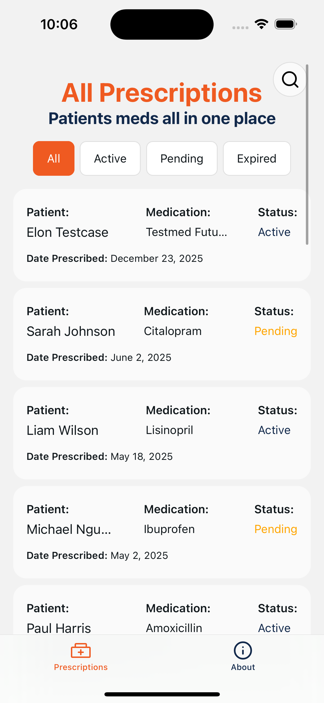

# VITURA Health 👋



A sample challenge app for Vitura Health, of how I may tackle rendering a list of prescriptions.

## Tech Stack

- React Native
- Expo
- Expo Router
- TypeScript
- Jest
- StyleSheet for styling

## State Management

- React Context API

## Data Management
There is a sample fetch to a dummy API, however this falls back to the Mock Data for this app scenario. I was tempted to reach for Tanstack Query which in the wild I may have used for performing the fetch.

## Testing
There are some tests setup for the utils.
Further time permitted this would expand across the app components


## Features


- View a single prescription
- View all patient's prescriptions
- List loading state / error / empty state
- Status filtering
- Search for a patient

## Assumptions
- Tested within iOS sim only on development
- Utilise Expo-Go

## Get started

1. Install dependencies

   ```bash
   npm install
   ```

2. Start the app

   ```bash
   npx expo start 
   ```

3. Run some tests

   ```bash
   npm run test
   ```


## Want to see more


- [deprogram](https://www.deprogram.io): Josh Freeman.
